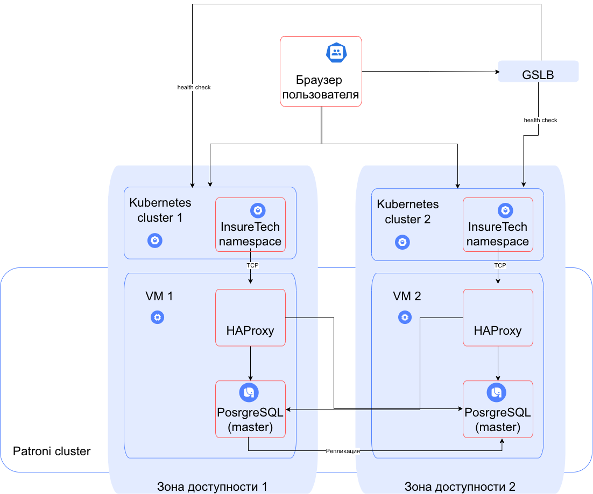

### Стратегия масштабирования и отказоустойчивости

**Масштабирование**

* Horizontal Pod Autoscaler (HPA): Внутри каждого кластера и региона для каждого микросервиса настраивается HPA на основе метрик CPU, Memory.
* Cluster Autoscaler: В каждом регионе включен Cluster Autoscaler для добавления новых узлов (нод) в кластер.
* Глобальное (Региональное) масштабирование: Поскольку трафик распределяется между регионами через Global Load Balancer, масштабируется приложение горизонтально, просто добавлением новых реплик.

Горизонтальное масштабирование эффективнее за счёт гибкости и отказоустойчивости.
Приложение разворачивается в нескольких регионах. Это снижает риск простоя при отказе одной зоны.

**Отказоустойчивость**

* Архитектура: Active-Active. Трафик: Запросы пользователей распределяются между всеми регионами одновременно.
* Зонирование: Каждый кластер Kubernetes в регионе должен быть развернут минимум в 2-х Availability Zones (AZ) провайдера.

### Конфигурация и балансировка нагрузки

**Балансировка нагрузки**

* Внешний трафик должен проходить через Global Load Balancer.
* Внутри кластера трафик должен проходить в связке Kubernetes Service + Ingress Controller.
* Мониторинги здоровья (Health checks): Liveness и Readiness probes для pod-ов.

**Фейловер-стратегия**

Благодаря Active-Active, ручной failover не нужен. Работает автоматический failover.
Сбой пода или ноды: Kubernetes перезапускает на другой ноде. GLB автоматически направляет 100% трафика в живой регион.

**Конфигурация базы данных**

**PostgreSQL-кластер**

* Синхронная/асинхронная репликация.
* Автоматический failover.
* Регулярные бэкапы.

Шардирование БД не применяется.

### TO BE

[InsureTech_технологическая_архитектура_to_be.drawio.xml](InsureTech_технологическая_архитектура_to_be.drawio.xml)
