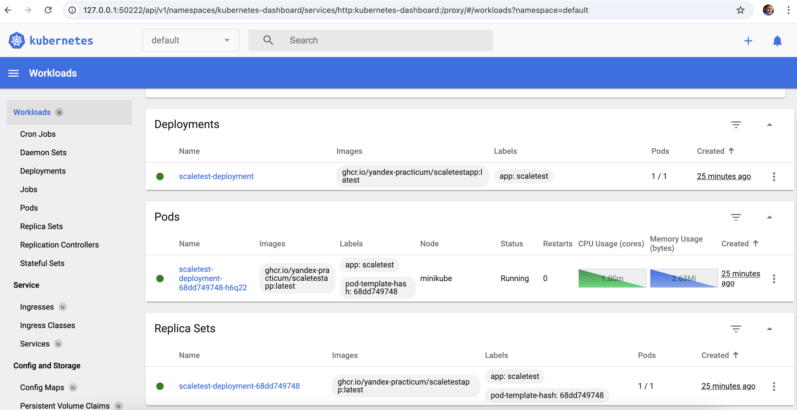
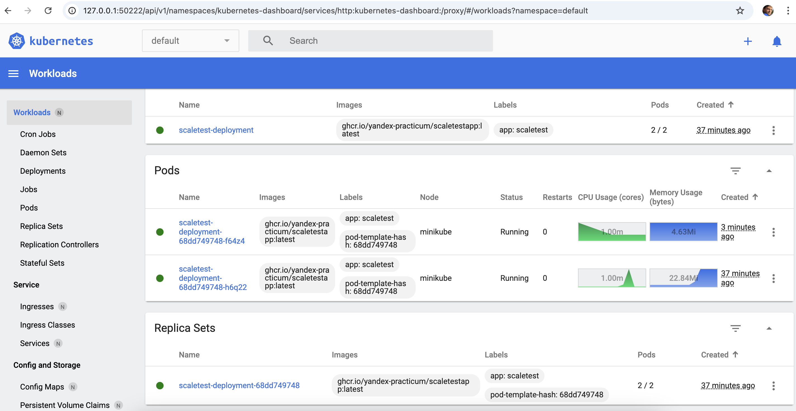
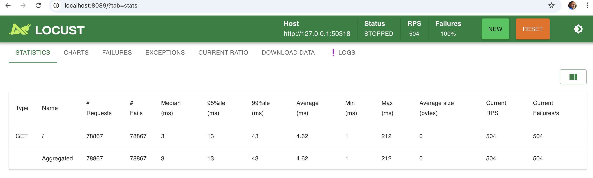

## Задание 2. Динамическое масштабирование контейнеров

### Подготовка

**Локальный кластер Kubernetes в Minikube**

```
minikube start --cpus=2
```

**metrics-server**

```
minikube addons enable metrics-server
```

```
minikube status
```

**Манифест развёртывания (Deployment) Kubernetes для запуска тестового приложения**

```
kubectl apply -f deployment.yaml
```

**Манифест сервиса (Service)**

```
kubectl apply -f service.yaml
```

**Динамическая маршрутизация**

```
kubectl apply -f hpa.yaml
```

```
minikube service scaletest-service --url 
```

```
kubectl get hpa
```

Пример запуска.

```
NAME            REFERENCE                         TARGETS           MINPODS   MAXPODS   REPLICAS   AGE
scaletest-hpa   Deployment/scaletest-deployment   memory: 13%/80%   1         10        1          2m3s
```

**Установка locust**

Подготовленное окружение.

```
pip install locust
```

### Запуск

```
locust
```

```
minikube dashboard
```



Запуски locust:

```
Users = 1500
Rump up = 30
Run time = 2m..10m
```

Результаты:




