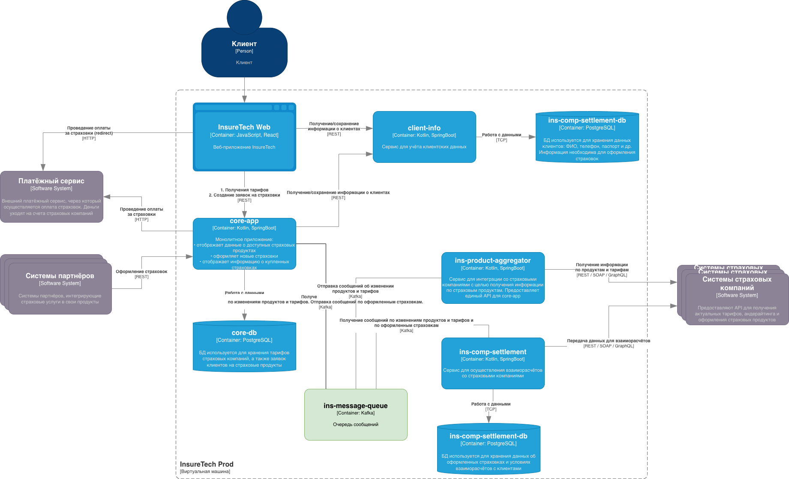

## Задание 3. Переход на Event-Driven архитектуру

### Список проблем

**Низкая производительность**

Синхронное получение данных от всех страховых компаний в момент запроса от core-app 
и ins-comp-settlement приводит к линейному росту времени ожидания. 
core-app может «подвисать» из-за медленного ответа одной из страховых компаний.

**Сбои и ошибки**

Отказ или задержка ответа API хотя бы одной страховой компании приводит к сбою или таймауту.

**Несогласованность данных**

Разная периодичность обновления локальных копий приводит к тому, что сервисы работают с разными версиями данных 
о продуктах и тарифах в один и тот же момент времени. 
Это может вызывать логические ошибки (например, расчет реестра страховок по устаревшим тарифам).

**Отсутствие отказоустойчивости**

Локальные реплики обновляются только по расписанию. Если агрегатор или страховые компании недоступны
в момент планового обновления, сервисы остаются со старыми данными до следующей удачной попытки.

### Риски

**Риск линейного падения производительности**

Увеличение числа источников (с 5 до 10) приведет к пропорциональному росту времени ожидания ответа от ins-product-aggregator. 
Для синхронного вызова это критично — время ответа сервисов для клиентов может превысить допустимые таймауты.

**Риск каскадного отказа**

Чем больше страховых компаний, тем выше вероятность, что хотя бы одна из них ответит с ошибкой или зависнет. 
В текущей синхронной модели это вызовет сбой всего запроса к агрегатору, оставив без данных все сервисы-потребители.

**Риск рассинхронизации данных**

Разные интервалы обновления реплик будут усугублены. 
После добавления новых компаний данные в сервисах будут «расходиться» еще сильнее, 
что приведет к ошибкам в расчетах и отчетах.

**Риск потери данных**

Запрос ins-comp-settlement к core-app за всеми оформленными за день страховками — это потенциально тяжелый запрос. 
С ростом числа продуктов и клиентов объем данных может стать критическим, 
что приведет к таймаутам или падению core-app во время процесса.

### Предлагаемое решение в части взаимодействия с внешними API партнеров

Внедрение event-driven архитектуры с использованием брокера сообщений (Kafka).

На данном этапе паттерн Transactional Outbox не используется.

* core-app публикует события об оформленных страховках и получает сообщения об изменении продуктов.
* ins-product-aggregator периодически обновляет данные из внешних API и публикует события об изменении продуктов и тарифов. 
* ins-comp-settlement подписывается на события об обновлении продуктов, тарифов, страховок.

[InsureTech_C4_сontainer-diagram_to_be.drawio.xml](InsureTech_C4_сontainer-diagram_to_be.drawio.xml)
